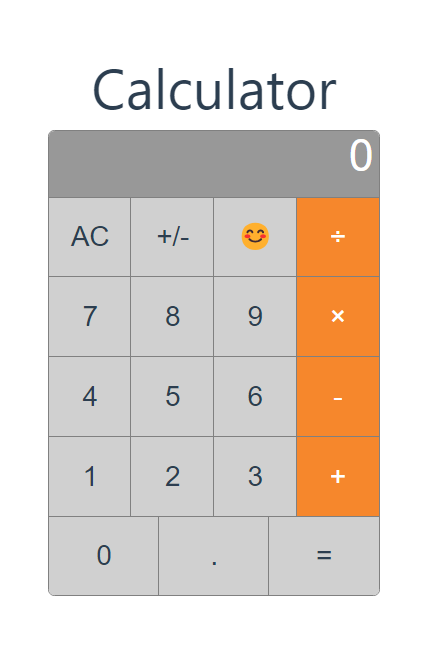

# Calculator App

This is a simple calculator web application built using Vue.js. You can perform basic arithmetic calculations using this calculator, such as addition, subtraction, multiplication, and division.

## Features

- Addition (+), subtraction (-), multiplication (×), and division (÷) operations.
- Clear all (AC), change sign (+/-), and equals (=) buttons.
- Automatic font size adjustment for long numbers.

## Reference: 
- https://www.youtube.com/watch?v=MRsDx3sFKOs